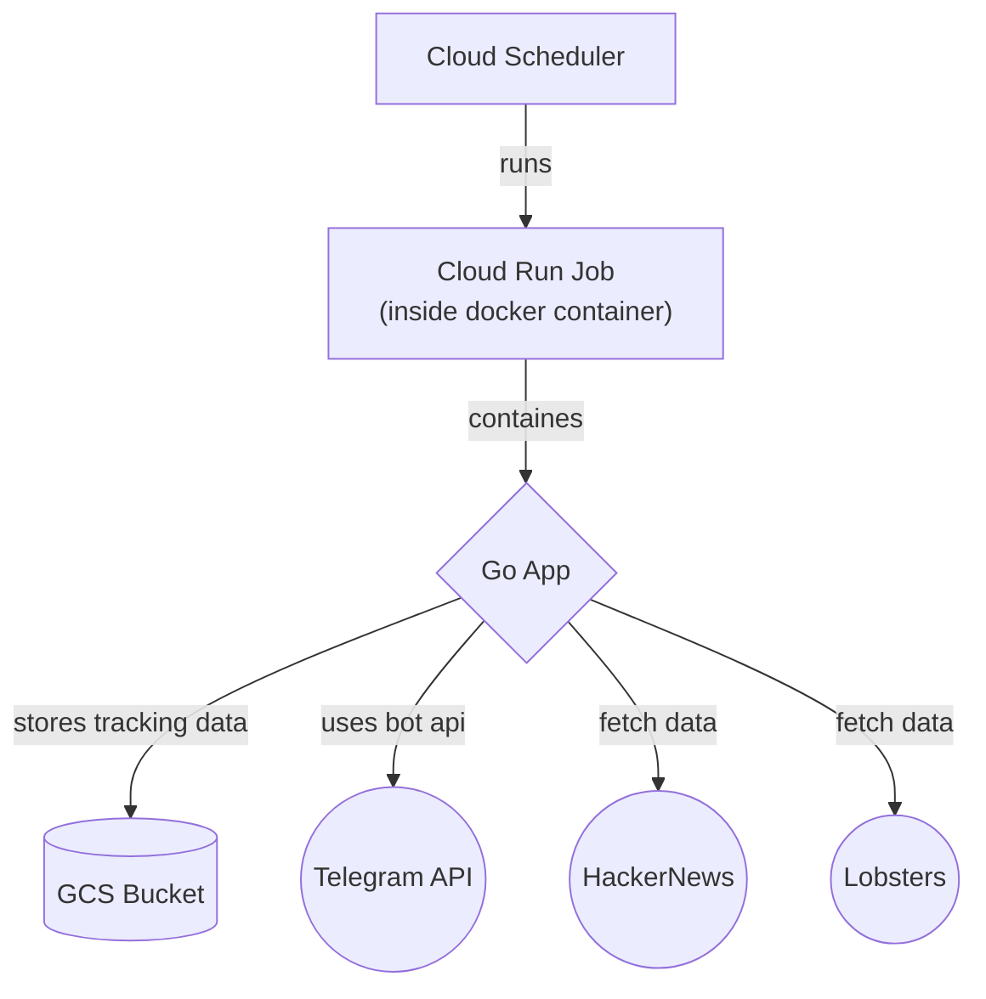

# newsagg

My news aggregator

## Project Architecture

## Deployemnt

Manual:
- GCP project creation
- github token
- sentry project and dsn
- telegram channel and bot setup

Infra via terraform:
- artifacts registry
- storage bucket
- service accounts and bindings
- github secrets and vars

Deployment via terraform:
- cloud run job
- cloud schedule job

CI:
- github action workflow with image build and tf deploy
- connects infra and deploy
