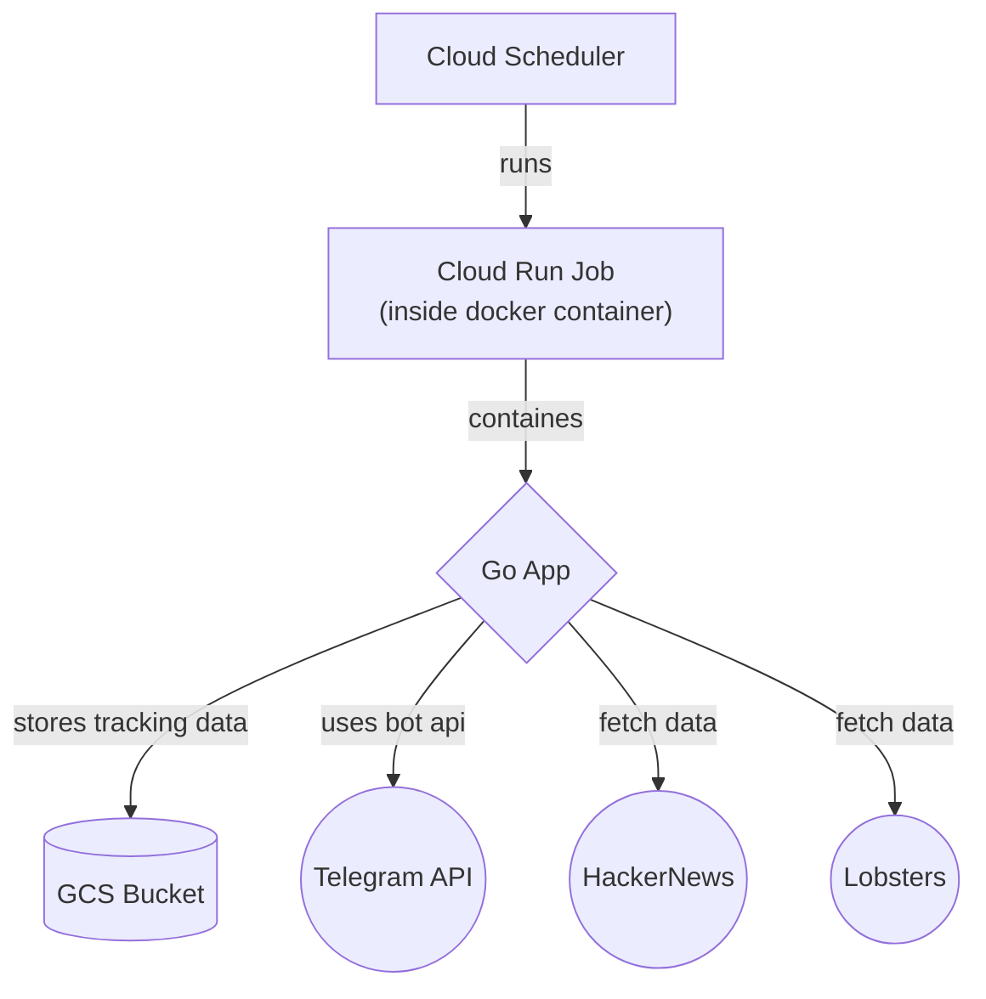

# newsagg

Mini news aggregator. It scraps articles from Hacker News and Lobste.rs and push them to 
[News Aggregator](https://telegram.me/newnewsagg) telegram channel.

Aside from that, it also served as a practice ground for using Terraform and GCP.

## Project Architecture

Arch motivation: its free to run.

## Infra and deployment setup

Manual:
- GCP project creation
- github token for terraform
- sentry project and dsn
- telegram channel and bot setup

Infra - run terraform localy with all the secrets:
- artifacts registry
- storage bucket
- service accounts and bindings
- github secrets and vars
- workload identity for github actions

Deployment using terraform via CI/CD:
- cloud run job
- cloud schedule job

CI:
- github action workflow with image build and tf deploy
- connects infra and deploy
